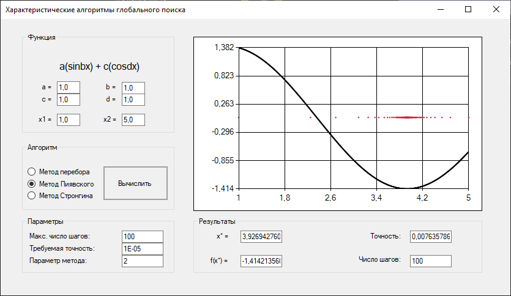
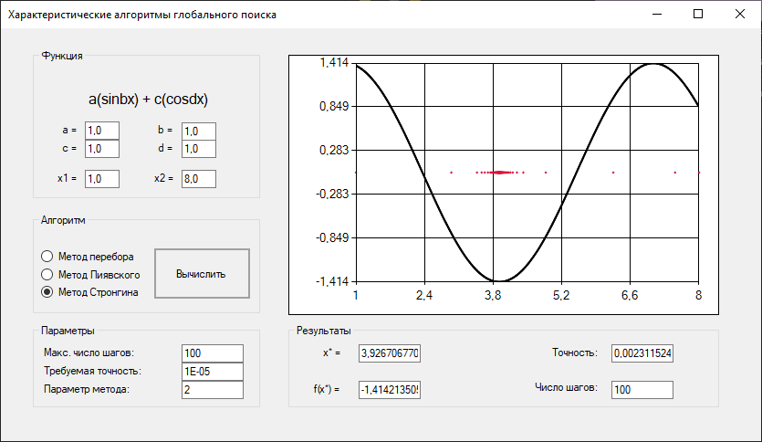

# Характеристические алгоритмы глобального поиска

C++, Visual Studio

--------------

Реализация алгоримов глобального поиска:

- Метод перебора
- Метод Пиявского
- Метод Стронгина

## Скриншоты

